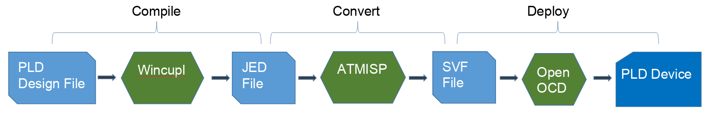

# VS CUPL Documentation
## Table of Contents
- [Background](#background)
- [Features](#features)
- [Deployment](#deployment)
- [Getting Started](#getting-started)
- [User Environment](#user-environment)
- [Using VS Cupl](#using-vs-cupl)
- [Extension Settings](#vs-cupl-extension-settings)
- [CUPL Language](#cupl-language)
- [Release Notes](#release-notes)
- [Roadmap](#roadmap)
## Background
 Atmel and Lattice corporations created CPLDs, or Complex Programmable Logical Devices in the late 80s and 90s. These allowed designs for combinational logic to be more robust, with support for ISP (In System Programming) for some of the later models.

 These PLDs can be very useful in many circuits, but the software and other deployment tools are all but abandoned. While they are still available online, their user interface and experience are sub par. And most of the tools require Windows with a Linux Subsystem for some devices, or Linux with Wine.

 While developing with these PLDs, I was fed up with the experience, and decided to create an extension for Visual Studio Code, to improve the development and deployment process.

 This extension is the result of that effort; I continue to improve on it as I use it and find places for improvement. 

 **New contributors are always welcome!**

## Features

Manage CUPL projects with functionality to automate build, convert, and deployment to CPLDs.
Gives your PLD design projects version control through git!


#### Project Management
  - Create a project, or import an existing `Cupl` PLD file.
  
  - Open multiple Projects

  - View Pin Layout and signals for CPLD

#### Code assistance

  - Double click pins on chip viewer to insert snippet

  - Snippet support for all keywords

  - Intellisense for logical signal type


### Deployment

There are two deployment chains available, depending on your PLD.
#### Small PLDs
[Detailed instructions for minipro based deployment](assets/docs/DEPLOY-MINIPRO.md)

Deployment is a one step process for PLDs like ATF22xx, G16xx, G20xx, G22xx, V750

- **Uses a TL886+ or similar programmer**
- Once you have completed your changes in the PLD file, compile.
- Once compiled, press F6 or use the menu shortcut to deploy your JED file to your PLD using minipro.

#### Large PLDs
[Detailed instructions for OpenOCD based deployment](assets/docs/DEPLOY-OPENOCD.md)

For larger PLDs like the ATF1500 family, there is an additional step required to convert the JDEC file to SVF format

 - **Uses a [homebrew ATF1500 family chip programmer](https://github.com/hackup/ATF2FT232HQ)**
 

## Getting Started
### Environment Configuration Walkthrough
When you first install the extension, you should see a walkthrough screen to help you set up your environment. If you do not, open your command pallette and search for Walkthrough

and select the PLD walkthrough


Follow the steps to ensure your environment is ready for deployment to your PLD


For troubleshooting toolchain or environment issues, it may be useful to read the legacy [Installation instructions](assets/docs/INSTALL.md)

### User Environment
#### Using VS Cupl
VS Cupl has seven parts for your PLD project development:

**1. Project View**
Header lets you create new projects, import existing PLD files into new projects, open existing VS Cupl projects, or access extension settings

Project details lets you view and modify your design file, as well as execute actions for each type of file


**2. Project Tasks**
Header lets you create, import, or open a project, or check prerequsites

Project Items let you execite all build and deployment actions for the project


**3. Active Project View**
Shows you details about the project. You can access project configuration screen for here.


**4. Output**
View details of commands and tools executed on your behalf.


**5. Chip View**
Visual representation of your selected PLD. 
Click on a pin to select it, giving you the pin assignment and type information.
Double click a pin to add to your design file


**6. PLD editor**
Supports intellisence for CUPL keywords and signals.


**7. Pin View**
Listing of all pins of your project's PLD.
Shows type of pin and any additional functionality it might support


#### VS Cupl Extension Settings

This extension contributes the following settings:

*Can be configured in File > Preferences > Settings `` |`` Extensions > VS Cupl*
*Or accessed through the projects view header* 


Settings are split into several sections

**Be sure to pay extra attention to the paths section if you are having any issues with deployment**
*Some sections are explicitly available for various operating systems, e.g. Wine is not available on windows*


---

## CUPL Language
Quick reference guide [Cupl Reference Guide](assets/docs/CUPL.md)
**Read more about [Cupl](https://ece-classes.usc.edu/ee459/library/documents/CUPL_Reference.pdf)**

## Release Notes

See [Change Log](CHANGELOG.md) for changes in each version.

---

# Roadmap
In future releases, several features are eagerly awaited:
1. Action history - currently a user needs to scroll through output of various length to determine if a task succeeded or not. It would be very nice to have a window that shows a list/grid of previous commands (build, deploy, run atmisp), their status (running, done, failed), and output available per command
2. Including SI and possibly other files when copying back to linux. Integrate calling cupl simulator application with the project's SI file.
3. Debug environment configuration during walkthrough, especially adding the necessary comctl32 and comctl32ocx, comdlg32ocs, mcf40 and mcf42 wine components. Make sure DLLs from assets are copied to windows system32 and syswow64 folders
4. Add step for walkthrough, download Pof2jed (optional) - useful for VHDL/Verilog development with QuartusII

# For developers

## Requirements
You may need to install resolve-cwd npm package
```npm install resolve-cwd```

## To start developing

```
git clone https://github.com/levvayner/ATF15xx-cupl.git
cd ATF15xx-cupl
npm install
code .
```
This will open up the project in visual studio. You can press F5 to start debugging.


## Following extension guidelines

Ensure that you've read through the extensions guidelines and follow the best practices for creating your extension.

* [Extension Guidelines](https://code.visualstudio.com/api/references/extension-guidelines)

