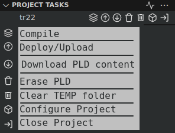

# Deployment using VS Cupl, Wincupl, and minipro

This guide describes step by step process to deploy your cupl code to a PLD using the minipro program and a TL866+ or similar programming device.

# Steps
1. Comple `.pld` file using the `Ctrl + Shift + B` keyboard shortcut or the compile icon from the project view

2. Deploy to PLD using minipro using F6 keyboard shortcut or the deploy JED icon

# Minipro based PLD tasks

