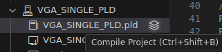
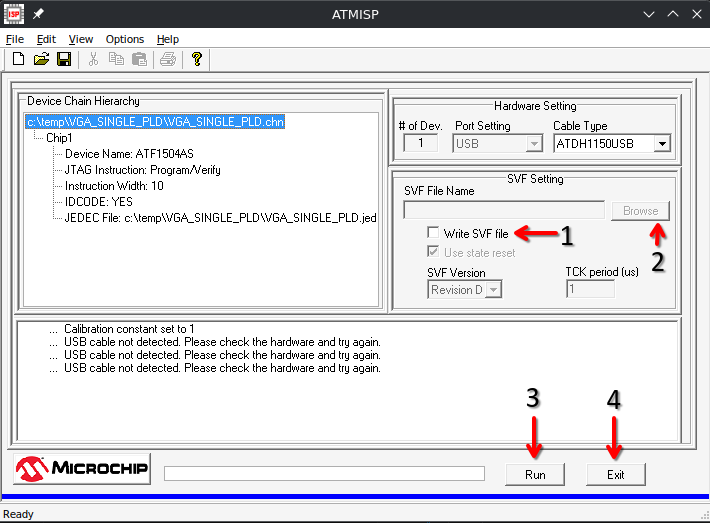
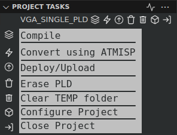

# Deployment using VS Cupl, Wincupl, ATMISP, and OpenOCD

This guide describes step by step process to deploy your cupl code to a PLD using ATMISP to convert the JED file to an SVF file, and a homebrew or similar programming device.

# Steps
1. Comple `.pld` file using the `Ctrl + Shift + B` keyboard shortcut or the compile icon from the project view

2. Convert JED file to SVF format using ATMISP.
Use F6 keyboard shortcut or the deploy JED icon

*You may have to disconnect your programming device for ATMISP to work properly*

    1. Select "Write SVF File" option
    2. Select Browse
    - **If you are using Linux, make sure you are selecting the correct folder to create your SVF file**
    - It should be C:\temp\[PROJECT NAME]
    - Enter a name for the project or select an existing SVF file to overwrite
    3. Press run; wait for the progress bar to show it has completed. 
    4. Press exit.

3. Deploy the SVF file to your PLD using the [homebrew programmer](https://github.com/hackup/ATF2FT232HQ)

# OpenOCD based PLD tasks

