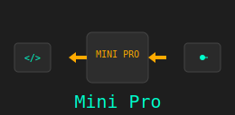

# Minipro Installation

Minipro is a tool to program many different PLDs using TL866II programmer.
- It requires WSL (Windows Subsystem for Linux) to be installed on Windows. 
- It can be used to program .jed files to many PLDs.

_Read more on [Github](https://gitlab.com/DavidGriffith/minipro)_
