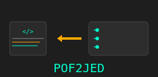

# POF2JED Installation

POF2JED supports using hardware definition languages like Verilog and VHDL for circuit design for Microchip ATF15xx CPLDs.
- Quartus version 13.0sp1 can be used to develop for these chips using their MAX7000 series analogs.
- Output can be converted to JED files for ATMISP processing. 
---
POF2JED can be installed from [the official Microchip site](https://ww1.microchip.com/downloads/archive/pof2jed.zip)